# Virtualizing Db2 Warehouse data with data virtualization

Companies have attempted to break down silos for decades by copying data from many operating systems into central data repositories for analysis, such as data marts, warehouses, and lakes. This is frequently costly and error-prone. Most companies struggle to handle an average of 33 different data sources, all of which are different in structure and type, and are frequently stuck in data silos that are difficult to locate and access. Data virtualization allows you to query data across several systems without having to copy and replicate data, saving you time and money. Because you're accessing the most recent data at its source, it can help simplify your analytics and make them more up to date and accurate. In this tutorial, we’re going to learn how to leverage IBM Cloud Pak for Data's data virtualization with Db2 warehouse to make queries across multiple data sources. 

## Learning objectives
In this tutorial, you will learn how to: 
* Setup the project on IBM Cloud Pak for Data 
* Add datasets to IBM Cloud Pak® for Data. 
* Add a data source for data virtualization. 
* Virtualize the data and create a joined view. 
* Assign virtualized data to a project. 
* Add roles to users and perform admin tasks. 

## Steps
### Step 1. About the dataset 
The dataset used for this tutorial contains information about fraud auto insurance claims for an insurance company. The data was collected in three CSV files. 
1. claims.csv - Some of the important attributes in this file are 
* Claim Id
* Capital Gains ($) 
* Capital Loss ($) 
* Incident Type (Single Vehicle collision, Vehicle Theft etc.) 
* Collison Type (Read Collision, Side Collision etc.) 
* Incident Severity (Minor Damage, Total Loss etc.) 
* Authorities Contacted (Ambulance, Police etc.) 
* Incident Hour of the day 
* Number of vehicles involved 
* Witnesses 
* Total claim amount ($) 
* Fraud reported (Yes, No)

2. customer.csv - Some of the important attributes in this file are
* Customer Id
* Insured Sex (Male, Female)
* Insured Occupation (Craft repair, sales etc.)
* Insured Hobbies (Chess, Cross fit etc.)

3. policies.csv - Some of the important attributes in this file are
* Claim Id
* Policy Id
* Coverage (Basic, Premium etc.)
* Policy Annual Premium ($)
* Auto Make (Dodge, Chevrolet etc.)

### Step 2. Set up the project on IBM Cloud Pak for Data

**Log in to IBM Cloud Pak for Data**

1. Launch a browser and navigate to the IBM Cloud Pak for Data url.
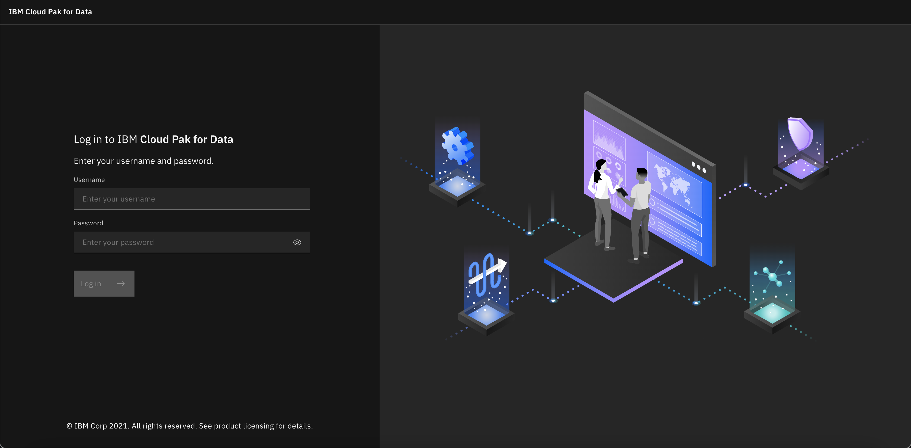

**Create a new IBM Cloud Pak for Data project**
1. Go the hamburger (☰) menu and click on the Projects dropdown, then click on All Projects.
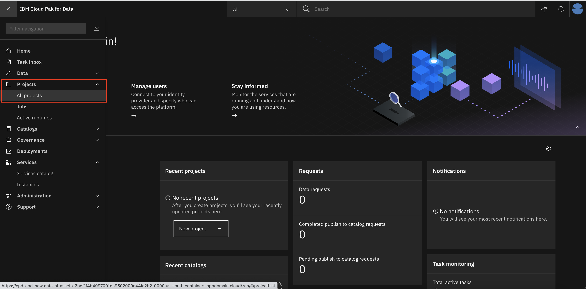

2. Click on New project. With the Analytics Project selected by default, click Next.
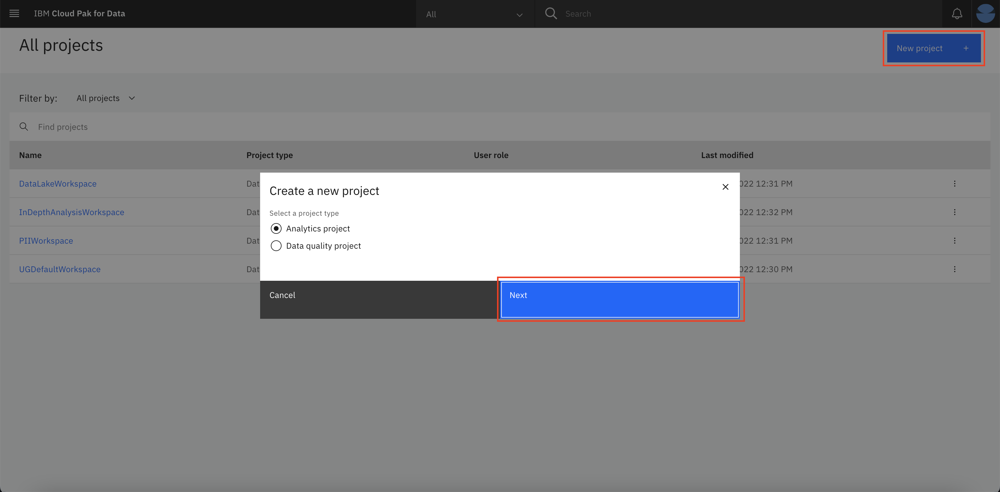

3. Select Create an empty project.
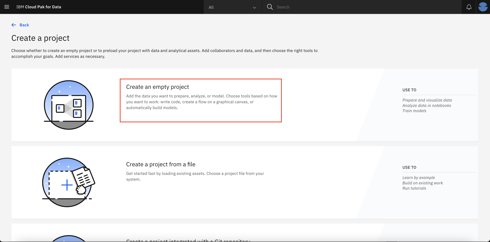

4. Provide a name and optional description for the project and click Create.
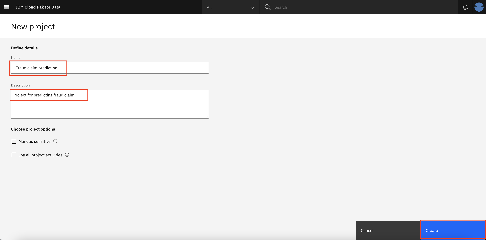


## Step 3. Set up the Db2 Warehouse
We’ll need a place to store our data. You can either setup Db2 Warehouse on IBM cloud or on Cloud Pak for Data. It is not require to complete both to proceed further. However, if you have multiple databases/data sources, you can easily use Data Virtualization to collect your data from multiple distributes data sources as shown in the next steps.

### Step 3A. Set up the Db2 Warehouse on IBM Cloud 
(Note: You can skip this step if you are using Db2 Warehouse on Cloud Pak for Data)
In this step, we will use Db2 warehouse on IBM Cloud . However, IBM Cloud Pak for Data can work with any database with a JDBC connector, so Db2 warehouse is only one of many choices. 

(Note: If you have not already setup an instance of Db2 Warehouse on IBM cloud, please complete the setup here: https://cloud.ibm.com/catalog/services/db2-warehouse)

Steps below are shown for fetching connection details for Db2 Warehouse on IBM Cloud.

1. Go to Service Credentials and click **New credential +**. Click the Copy to clipboard icon and save the credentials for later. 

2. Now go to Manage and click **Open Console**.
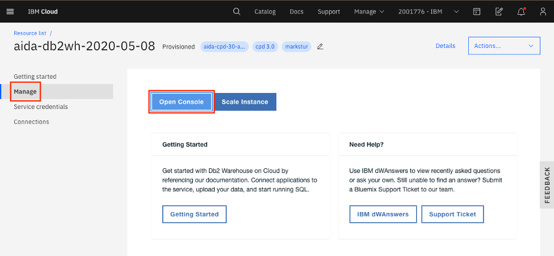

**Get SSL certificate for Db2 Warehouse on IBM Cloud**

You will need an SSL cert for IBM Cloud Pak for Data to use the IBM Cloud Db2 Warehouse instance.
1. In the Db2 Warehouse console, from the upper-left hamburger (☰) menu, click Administration → Connections, then Download SSL Certificate.
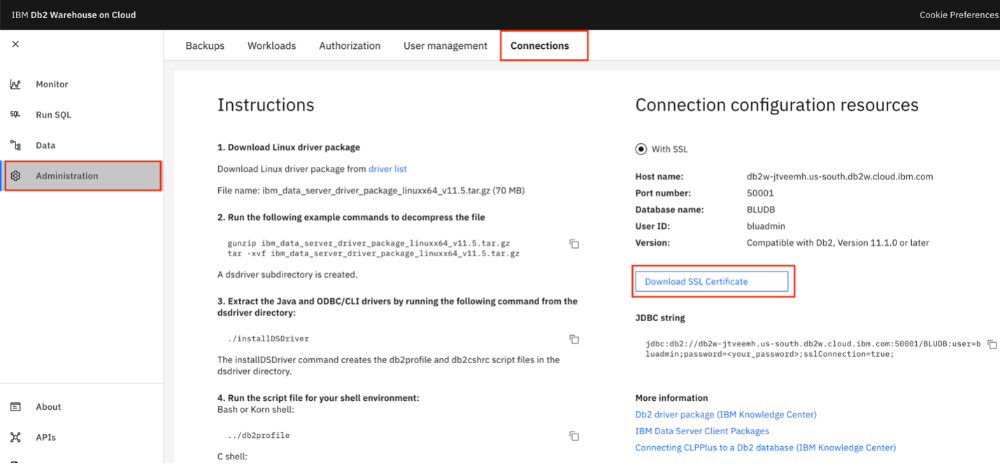


2. You will need to convert the SSL certificate from .crt to a .pem file using OpenSSL. Run the following command: 

```bash openssl x509 -in DigiCertGlobalRootCA.crt -out DigiCertGlobalRootCA.pem -outform PEM -inform DER```

**Seed the Db2 Warehouse on IBM Cloud**

Steps below are shown for uploading data to Db2 Warehouse on IBM Cloud.
1. From the upper-left hamburger (☰) menu, click **LOAD → Load data**. 
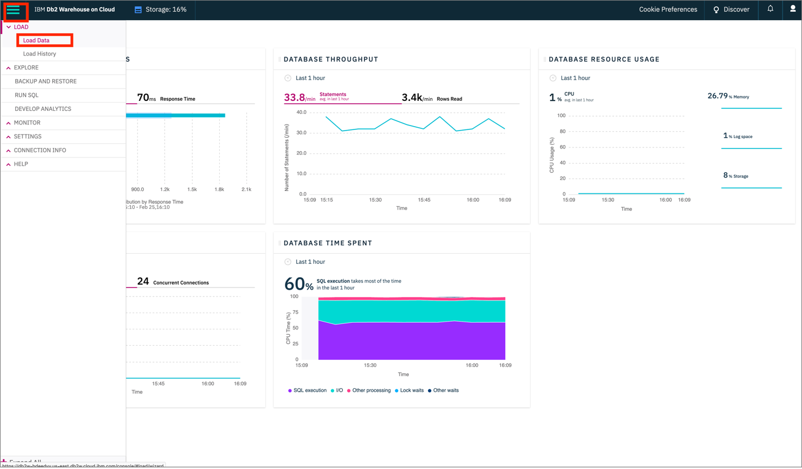

2. Click browse files and select the claims.csv file after downloading it from the link, then click Next.


3. Choose Schema INSURANCE and click + New table. Under Create a new Table, provide CLAIMS as the name of the table and click Create, then Next. 4. Accept the defaults and click Next. On the next screen, click Begin Load.
3. Repeat for the policies.csv file, naming the table POLICIES and the customers.csv table CUSTOMERS. Now the Db2 warehouse has been set up on IBM Cloud.
Cloud Pak for Data Workshop 2020

## Step 4. Add a new data source connection
1. From the hamburger (☰) menu, click on the Data dropdown and then click on Databases.(Note: If you have note installed Db2wh on Cloud Pak for Data, then you must complete the Db2wh setup: https://www.ibm.com/docs/en/cloud-paks/cp-data/latest?topic=warehouse-installing-db2-service)
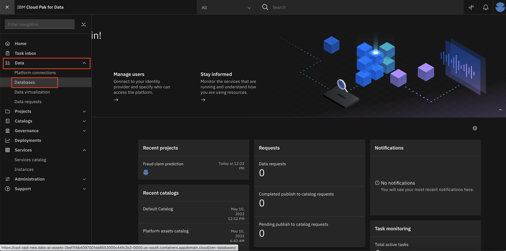

2. On the databases page, click on the 3 dots at the top right corner of your db2wh instance and then select Details
(Note: If you are planning to use Db2wh on IBM Cloud or any other database, then you might not have setup the Db2Wh on Cloud Pak for Data and this database will not be available for you.)
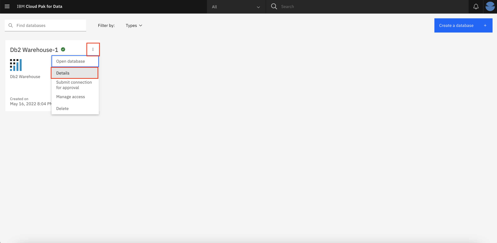

3. Collect the following details - Database name, HOSTNAME and Port from the Db2wh details page. 
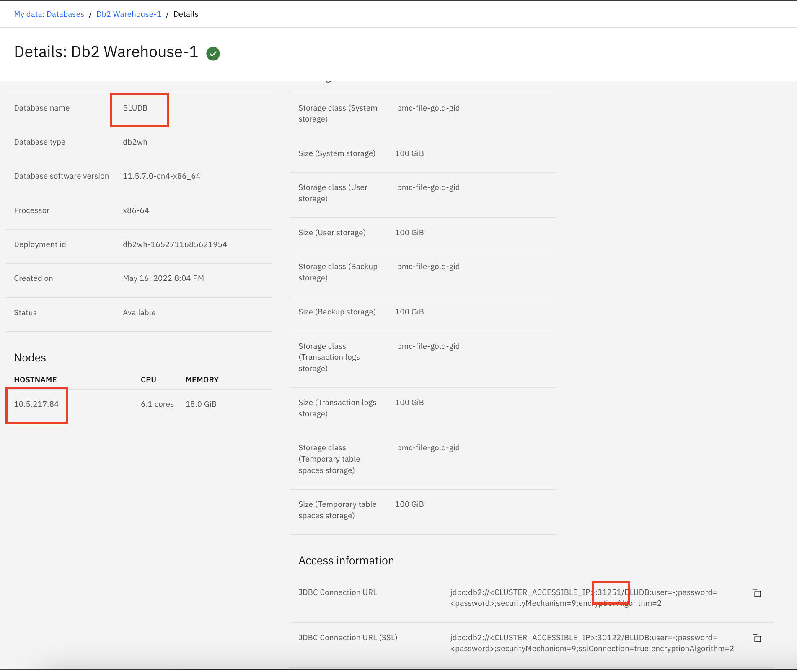

4. Now go to the hamburger (☰) menu and click on the Platform connections.
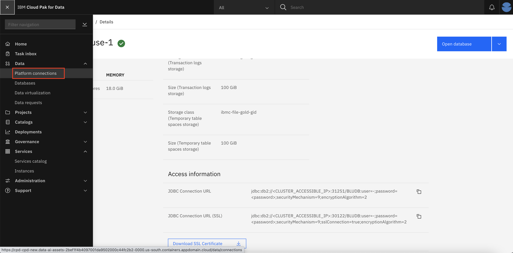


Add the new data source 1. To add a new data source, go to the hamburger (☰) menu and click on the Connections option.
2. At the overview, click New connection +.
Cloud Pak for Data Workshop 2020
Enter connection details for Db2 Warehouse on IBM Cloud 1. Start by giving your new connection a name, and select Db2 Warehouse on Cloud as your connection type. More fields should appear. Fill in the new fields with the credentials for your Db2 Warehouse connection. Click the checkbox for Use SSL. (Note – Please add your initials at the end of the connection name with a dash. For example, db2-warehouse-srs in order to avoid conflict)
2. Enter the following service credentials to create a connection to the Db2 warehouse on IBM Cloud.
"hostname": "db2w-jtveemh.us-south.db2w.cloud.ibm.com",
"password": "GxduaIWj_f4aZq82Ah@4@KqmHAkEF",
"port": 50001,
"db": "BLUDB",
"username": "bluadmin",
3. Download the SSL certificate and upload it to create connection.
The new connection will be listed in the overview.
Cloud Pak for Data Workshop 2020
Step 5. Virtualize Db2 data with data virtualization NOTE: This section requires Admin user access to the IBM Cloud Pak for Data cluster. For this section, we’ll use the data virtualization tool to import the data from Db2 Warehouse, which is now exposed as a connection in IBM Cloud Pak for Data. Add a data source to Data Virtualization 1. To launch the data virtualization tool, go the hamburger (☰) menu and click Collect and then Data Virtualization.
Cloud Pak for Data Workshop 2020
2. At the empty overview, click the drop-down next to Add new data source and select From existing connections 3. Select the data source we made in the previous step and click Next.
Start virtualizing data Because we now have access to the Db2 Warehouse data, we can virtualize the data to our IBM Cloud Pak for Data project.
Cloud Pak for Data Workshop 2020
1. Click on the Data Sources drop-down and choose Virtualize.
2. Several tables will appear (many are created as sample data when a Db2 Warehouse instance is provisioned) in the table. Find the tables that was created earlier, the previous instructions suggested naming them CUSTOMERS, POLICIES, and CLAIMS. Or you can search them by filtering on Schema = INSURANCE. Once selected, click Add to cart and then View Cart.
3. The next panel prompts the user to choose which project to assign the data to. Choose My virtualized data and uncheck the box that says Submit to catalog. Click Virtualize to start the process.
Cloud Pak for Data Workshop 2020
4. You’ll be notified that the virtual tables have been created. Let’s see the new virtualized data from the data virtualization tool by clicking View my virtualized data.
Join the virtualized data Now we are going to join the tables we created so we have a merged set of data. It will be easier to do it here rather than in a notebook where we would have to write code to handle three different datasets. 1. Click on any two tables (CLAIMS and POLICIES, for instance), then click the Join button.
Cloud Pak for Data Workshop 2020
2. To join the tables, we need to pick a key that is common to both datasets. Here we choose to map claim_id and policy_id from the first table to claim_id and policy_id on the second table. Do this by clicking one and dragging it to the other. When the line is drawn, click Next.
3. Next, you have a chance to edit column names, but we will keep them as-is. Click Next.
Cloud Pak for Data Workshop 2020
4. In the next panel, we’ll give our joined data a unique name such as POLICIESCLAIMS (to be consistent with SQL standards, pick an uppercase name). Under Assign to, choose My virtualized data and uncheck the box that says Submit to catalog. Click Create view to start the process.
Cloud Pak for Data Workshop 2020
5. You’ll be notified that the join has succeeded. Click on View my virtualized data to go back and see all your virtualized data.
6. IMPORTANT Now join the new joined view (POLICIESCLAIMS) and the last virtualized table (CUSTOMERS) to create a new joined view that has all three tables; let’s call it POLICIESCLAIMSCUSTOMERS. Switching back to the My virtualized data screen should show all three virtualized tables and two joined tables. Do not go to the next section until this step is performed.
Grant access to the virtualized data For other users to have access to the data you just virtualized, you need to grant it. Follow these steps to make your virtualized data visible to them: 1. Go to Data Virtualization from the hamburger (☰) menu. Click on Menu → My virtualized data. 2. Click on the virtualized data you’ve created, then click the three vertical dots to the right, and choose Manage access.
Cloud Pak for Data Workshop 2020
3. Click the Specific users radio button, then Add user +.
Cloud Pak for Data Workshop 2020
4. Select the users you wish to grant access to and click Add users.
Repeat the above steps for the remaining tables and views. Assign the Engineer role to the users IBM Cloud Pak for Data users that need to use data virtualization functions must be assigned specific roles based on their job descriptions. These roles are Admin, Engineer, User, and Steward. You can learn more about these roles on the IBM Cloud Pak for Data product hub. Let’s assign the Engineer role to some users:
Cloud Pak for Data Workshop 2020
1. From the hamburger (☰) menu, choose the Data Virtualization option, then click My virtualized data → User management.
2. Click on Add users + and update the role of the user to Engineer.
Cloud Pak for Data Workshop 2020
Step 6. Users assign virtualized data Now let’s look at how a user who has access to virtualized data can assign the data to their project — how to add the virtualized data as asset to a project. Assign the data to your project 1. From the hamburger (☰) menu, click on Collect → Data Virtualization. You will be brought to the My virtualized data section. Here you should see the data you can access (or that the administrator has assigned to you). Select the checkbox next to our original tables (CLAIMS, POLICIES, CUSTOMERS) and the joined tables (POLICIESCLAIMS, POLICIESCLAIMS CUSTOMERS), and click the Assign button to import them into your project. 2. On the Assign virtual objects screen, choose the project to assign the data. If there is a Submit to catalog checkbox on the top right, uncheck it and click the Assign button to add the data to your project.
Cloud Pak for Data Workshop 2020
3. In the pop-up panel, you will receive a confirmation that the objects have been assigned to your project. Click the Go to project button.
Alternatively, close the modal and go to your projects by clicking on the hamburger (☰) menu, then choosing Projects. 4. On the project page, click on the Assets tab to display the virtualized tables and joined tables that are now in your project.
Cloud Pak for Data Workshop 2020
Summary
This lab tutorial explained how to virtualize Db2 Warehouse data with data virtualization on IBM Cloud Pak for Data to make queries across multiple data sources. To continue the series and learn more about IBM Cloud Pak for Data, take a look at the next tutorial, Data visualization with data refinery.