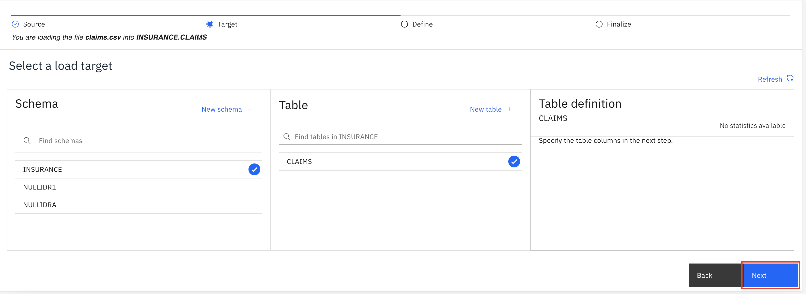
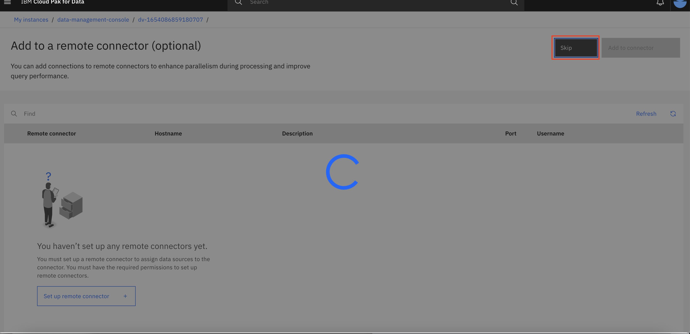
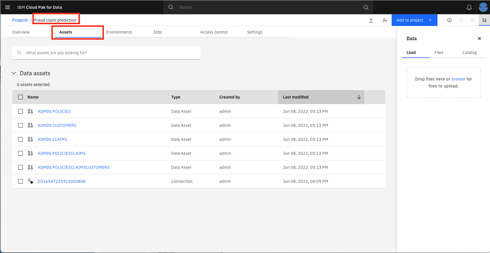

# Virtualizing Db2 Warehouse data with data virtualization

Companies have attempted to break down silos for decades by copying data from many operating systems into central data repositories for analysis, such as data marts, warehouses, and lakes. This is frequently costly and error-prone. Most companies struggle to handle an average of 33 different data sources, all of which are different in structure and type, and are frequently stuck in data silos that are difficult to locate and access. Data virtualization allows you to query data across several systems without having to copy and replicate data, saving you time and money. Because you're accessing the most recent data at its source, it can help simplify your analytics and make them more up to date and accurate. In this tutorial, we’re going to learn how to leverage IBM Cloud Pak for Data's data virtualization with Db2 warehouse to make queries across multiple data sources. 

## Learning objectives
In this tutorial, you will learn how to: 
* Setup the project on IBM Cloud Pak for Data 
* Add datasets to IBM Cloud Pak® for Data. 
* Add a data source for data virtualization. 
* Virtualize the data and create a joined view. 
* Assign virtualized data to a project. 
* Add roles to users and perform admin tasks. 

## Steps
### Step 1. About the dataset 
The dataset used for this tutorial contains information about fraud auto insurance claims for an insurance company. The data was collected in three CSV files. 
1. claims.csv - Some of the important attributes in this file are 
* Claim Id
* Capital Gains ($) 
* Capital Loss ($) 
* Incident Type (Single Vehicle collision, Vehicle Theft etc.) 
* Collison Type (Read Collision, Side Collision etc.) 
* Incident Severity (Minor Damage, Total Loss etc.) 
* Authorities Contacted (Ambulance, Police etc.) 
* Incident Hour of the day 
* Number of vehicles involved 
* Witnesses 
* Total claim amount ($) 
* Fraud reported (Yes, No)

2. customer.csv - Some of the important attributes in this file are
* Customer Id
* Insured Sex (Male, Female)
* Insured Occupation (Craft repair, sales etc.)
* Insured Hobbies (Chess, Cross fit etc.)

3. policies.csv - Some of the important attributes in this file are
* Claim Id
* Policy Id
* Coverage (Basic, Premium etc.)
* Policy Annual Premium ($)
* Auto Make (Dodge, Chevrolet etc.)

### Step 2. Set up the project on IBM Cloud Pak for Data

**Log in to IBM Cloud Pak for Data**

1. Launch a browser and navigate to the IBM Cloud Pak for Data url.


**Create a new IBM Cloud Pak for Data project**
1. Go the hamburger (☰) menu and click on the Projects dropdown, then click on All Projects.


2. Click on New project. With the Analytics Project selected by default, click Next.


3. Select Create an empty project.


4. Provide a name and optional description for the project and click Create.


## Step 3. Set up the Db2 Warehouse
We’ll need a place to store our data. You can either setup Db2 Warehouse on IBM cloud or on Cloud Pak for Data. It is not required to complete both to proceed further (Only Step 3A is needed for completing this tutorial and that 3B would apply if you want to experiment with a managed database outside of CPD). However, if you have multiple databases/data sources, you can easily use Data Virtualization to collect your data from multiple distributes data sources as shown in the next steps.

### Step 3A. Set up the Db2 Warehouse on Cloud Pak for Data
If you have not installed Db2wh on Cloud Pak for Data, then you must complete the Db2wh setup before proceeding further: https://www.ibm.com/docs/en/cloud-paks/cp-data/latest?topic=warehouse-installing-db2-service

1. From the hamburger (☰) menu, click on the Data dropdown and then click on **Databases**.


2. On the databases page, click on the 3 dots at the top right corner of your db2wh instance and then select **Details**
(Note: If you are planning to use Db2wh on IBM Cloud or any other database, then you might not have setup the Db2Wh on Cloud Pak for Data and this database will not be available for you.)


3. Collect the following details - Database name, HOSTNAME and Port from the Db2wh details page and save the credententails for later. 


**Seed the Db2 Warehouse on Cloud Pak for Data**
1. Open the database by clicking on the **Open database** button.


2. Click on the **Summary** dropdown and then select **Load Data** from **Load** dropdown.


3. On the load data page, drag and drop [claims.csv](https://github.com/ibm-hcbt/cp4d-assets/blob/main/Fraud_claim_use_case/data/claims.csv) from your local machine to the Db2wh console and then click **Next**. 


4. For the first file upload, create a new schema **INSURANCE** and use the same schema for loading the subsequent files.


5. Then create a new table **CLAIMS** under the schema **INSURANCE**.


6. Create table by clicking on **Next**


7. On the next page, confirm the headers and ensure that the *Header in first row* button is checked. Then click on **Next**. 


8. Review the summary on the next page and click **Begin Load**. Wait till the data is loaded to the Db2 Warehouse on Cloud Pak for Data. 


9. Repeat the steps 3-8 to load the [policies.csv](https://github.com/ibm-hcbt/cp4d-assets/blob/main/Fraud_claim_use_case/data/policies.csv) file, naming the table **POLICIES** and the [customers.csv](https://github.com/ibm-hcbt/cp4d-assets/blob/main/Fraud_claim_use_case/data/customers.csv) table **CUSTOMERS**. Now the Db2 warehouse has been set up on Cloud Pak for Data.

### Step 3B. Set up the Db2 Warehouse on IBM Cloud 
(Note: You can skip this step if you are using Db2 Warehouse on Cloud Pak for Data)
In this step, we will use Db2 warehouse on IBM Cloud . However, IBM Cloud Pak for Data can work with any database with a JDBC connector, so Db2 warehouse is only one of many choices. 

(Note: If you have not already setup an instance of Db2 Warehouse on IBM cloud, please complete the setup here: https://cloud.ibm.com/catalog/services/db2-warehouse)

Steps below are shown for fetching connection details for Db2 Warehouse on IBM Cloud.

1. Go to Service Credentials and click **New credential +**. Click the Copy to clipboard icon and save the credentials for later. 

2. Now go to Manage and click **Open Console**.


**Get SSL certificate for Db2 Warehouse on IBM Cloud**

You will need an SSL cert for IBM Cloud Pak for Data to use the IBM Cloud Db2 Warehouse instance.
1. In the Db2 Warehouse console, from the upper-left hamburger (☰) menu, click Administration → Connections, then Download SSL Certificate.


2. You will need to convert the SSL certificate from .crt to a .pem file using OpenSSL. Run the following command: 

```bash openssl x509 -in DigiCertGlobalRootCA.crt -out DigiCertGlobalRootCA.pem -outform PEM -inform DER```

**Seed the Db2 Warehouse on IBM Cloud**

Steps below are shown for uploading data to Db2 Warehouse on IBM Cloud.
1. From the upper-left hamburger (☰) menu, click **LOAD → Load data**. 


2. Click browse files and select the [claims.csv](https://github.com/ibm-hcbt/cp4d-assets/blob/main/Fraud_claim_use_case/data/claims.csv) file after downloading it from the Git Repository, then click Next.


3. Create a Schema **INSURANCE** and click **+ New table**. Under Create a new Table, provide **CLAIMS** as the name of the table and click **Create**, then **Next**. 


4. Accept the defaults and click **Next**. On the next screen, click **Begin Load**.


3. Repeat for the [policies.csv](https://github.com/ibm-hcbt/cp4d-assets/blob/main/Fraud_claim_use_case/data/policies.csv) file, naming the table **POLICIES** and the [customers.csv](https://github.com/ibm-hcbt/cp4d-assets/blob/main/Fraud_claim_use_case/data/customers.csv) table **CUSTOMERS**. Now the Db2 warehouse has been set up on IBM Cloud.

### Step 4. Add a new data source connection

1. Now go to the hamburger (☰) menu and click on the Platform connections.


2. On the Platform Connections overview page, click New connection +.


3. You will see supported connection types available on the next page. If you have setup another database to be used in this tutorial, you can create a connection for that particular database (for example - Amazon S3). Since we have setup Db2 warehouse on Cloud Pak for Data (some of you might have setup Db2 warehouse on IBM cloud based on Step 3B), we will not select the option Db2 Warehouse from the list of supported connection types and then click on **Select** button.


4. Enter connection details for Db2 Warehouse. Start by giving your new connection a name. You will now use the  credential details that you have collected from Step 3A.3 earlier. Enter the following credentials to create a connection to the Db2 warehouse on IBM Cloud.
Database, Hostname or IP address
Port, Authentication method, Username and Password.


5. Then click on **Test Connection** to verify your connection. Once the connection is tested, click on **Create** button to create the connection.


6. The new connection will now be listed on the Platform connection overview page.


### Step 5. Virtualize Db2 data with data virtualization 
If you have not installed Data Virtualization on Cloud Pak for Data, then you must complete the DV setup before proceeding further:
https://www.ibm.com/docs/en/cloud-paks/cp-data/latesttopic=virtualization-installing-data

NOTE: This section requires Admin user access to the IBM Cloud Pak for Data cluster. For this section, we’ll use the data virtualization tool to import the data from Db2 Warehouse, which is now exposed as a connection in IBM Cloud Pak for Data. 

**Add a data source to Data Virtualization**
1. To launch the data virtualization tool, go the hamburger (☰) menu and click **Data** and then Data Virtualization.


2. At the empty overview, click the **Add connection** button to add new data source and select From existing connections 


3. Select the data connection we created in the previous step and click **Add**.


4. On the next step, click on **Skip** button to skip remote connection (If you are setting up a remote connection rather than Db2 warehouse on Cloud Pak for Data, you can complete the setup in this step). 


**Start virtualizing data**

Because we now have access to the Db2 Warehouse data, we can virtualize the data to our IBM Cloud Pak for Data project.
1. Click on the Data Sources drop-down and choose Virtualize.


2. Several tables will appear (many are created as sample data when a Db2 Warehouse instance is provisioned) in the table. Find the tables that was created earlier, the previous instructions suggested naming them CUSTOMERS, POLICIES, and CLAIMS. Or you can search them by filtering on Schema = INSURANCE. Once selected, click **Add to cart** and then ****View Cart**.


3. The next panel prompts the user to choose which project to assign the data to. Ensure that the Fraud claim prediction is selected in the Project dropdown. Click Virtualize to start the process. You'll be asked to Confirm virtualization. Click **Continue**.


4. You’ll see success notification for Virtualization status and Assignment status on the next panel. Let’s see the new virtualized data from the data virtualization tool by clicking **View virtualized data**.


**Join the virtualized data**

Now we are going to join the tables we created so we have a merged set of data. It will be easier to do it here rather than in a notebook where we would have to write code to handle three different datasets. 

1. Click on any two tables (CLAIMS and POLICIES, for instance), then click the **Join** button.


2. To join the tables, we need to pick a key that is common to both datasets. Here we choose to map claim_id and policy_id from the first table to claim_id and policy_id on the second table. Do this by clicking one and dragging it to the other. Click **Next**.


3. Next, you have a chance to edit column names, but we will keep them as-is. Click **Next**.


4. In the next panel, we’ll give our joined data a unique name such as `POLICIESCLAIMS` (to be consistent with SQL standards, pick an uppercase name). Under Assign to, choose Virtualized data and uncheck the box that says Submit to catalog. Click **Create view** to start the process.


5. You’ll be notified that the join has succeeded. Click on **View virtualized data** to go back and see all your virtualized data.


6. IMPORTANT Now join the new joined view (POLICIESCLAIMS) and the last virtualized table (CUSTOMERS) on `CUSTOMER_ID` to create a new joined view that has all three tables; let’s call it POLICIESCLAIMSCUSTOMERS. Switching back to the My virtualized data screen should show all three virtualized tables and two joined tables. Do not go to the next section until this step is performed.


**Grant access to the virtualized data**

For other users to have access to the data you just virtualized, you need to grant it. Before proceeding further, ensure that the user you are trying to provide access to, has access to the Data Virtualization instance with Engineer role. This access needs to be provided explicitly. Then follow these steps to make your virtualized data visible to them: 
1. Click on the virtualized data you’ve created, then click the three vertical dots to the right, and choose Manage access.


2. Ensure that the Specific users and user groups radio button is selected, then **Grant access +**. Select the users you wish to grant access to and click Add users.


4. Repeat the above steps for the remaining tables and views. 

### Step 6. Assign the data to your project 

1. Select the checkbox next to our original tables (CLAIMS, POLICIES, CUSTOMERS) and the joined tables (POLICIESCLAIMS, POLICIESCLAIMS CUSTOMERS), and click the Assign button to import them into your project. 


2. On the Assign virtual objects screen, ensure that the `Fraud claim prediction` project is selected in the dropdown with the `Project` radio button selected to assign the data. Click the Assign button to add the data to your project.


3. In the pop-up panel, you will receive a confirmation that the objects have been assigned to your project. Click the **Go to project** button.
Alternatively, close the modal and go to your projects by clicking on the hamburger (☰) menu, then choosing **All Projects** from the Projects dropdown. 


4. Then select your project `Fraud claim prediction` on the All Projects page. Click on the Assets tab on the Project Overview page to display the virtualized tables and joined tables that are now in your project.


## Summary
This lab tutorial explained how to virtualize Db2 Warehouse data with data virtualization on IBM Cloud Pak for Data to make queries across multiple data sources. To continue the series and learn more about IBM Cloud Pak for Data, take a look at the next tutorial, Data visualization with data refinery.