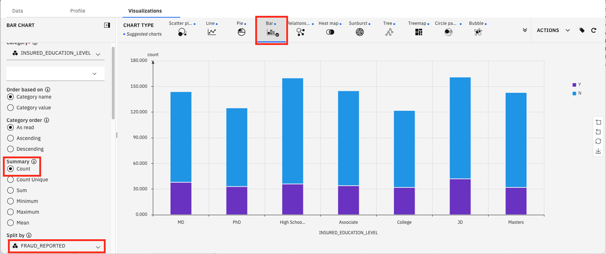
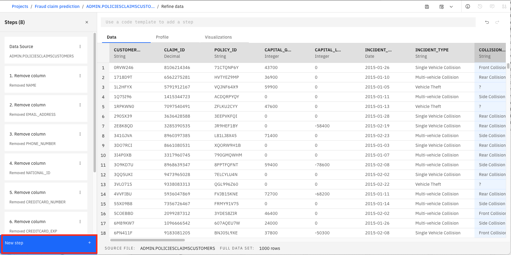
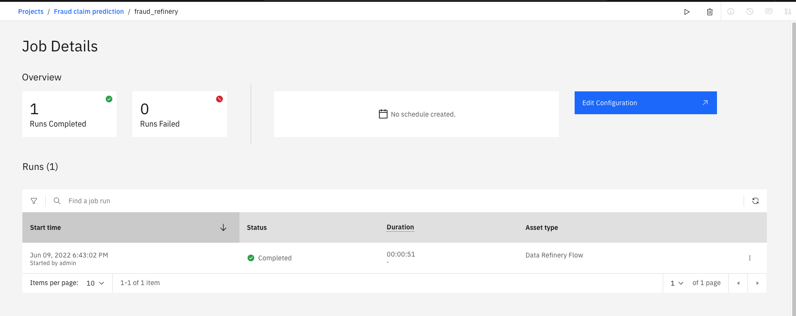

# Data visualization with data refinery

Data refinery is part of IBM Watson® and comes with IBM Watson Studio on the IBM Public Cloud, and IBM Watson Knowledge Catalog running on-premises using IBM Cloud Pak® for Data. It’s a self-service data-preparation client for data scientists, data engineers, and business analysts. With it, you can quickly transform large amounts of raw data into quality consumable information that’s ready for analytics. Data refinery makes it easy to explore, prepare, and deliver data that people across your organization can trust.

## Learning objectives
In this lab tutorial, you will learn how to: 
* Load data into the IBM Cloud Pak for Data platform for use with data refinery. 
* Transform a sample data set 
* Quickly profile data 
* Visualize the data with charts and graphs 
* Use Data Flow steps to keep track of your work. 
* Save the data refinery flow and create a job 

## Steps 
### Step 1. Load the virtualized data into data refinery

1. If you are not already on the Project Assets tab from the last tutorial on [Data Virtualization](https://github.com/ibm-hcbt/cp4d-assets/blob/ee9c1f7ea1d8e0c24c936fa313329986743c4b40/Fraud_claim_use_case/1.%20Collect%20Data.md), open the Project (Fraud Claim Prediction) that you created earlier and then click on
the **Assets** tab.

2. From the Assets tab, select the Data Asset that contains the combined table POLICIES, CLAIMS and CUSTOMERS created in the previous tutorial - `POLICIESCLAIMSCUSTOMERS`. You might be prompted to enter your credentials to unlock the connection. Enter your credentials, select `Username and Password` from the dropdown and click **Connect**.

3. You should be able to see the data as shown below. Click on Refine.

4. Data refinery should launch and open the data. Click on Maybe Later and close the modal.

5. Click the X by the Details button to close it.

### Step 2. Refine the data 

We’ll start out on the Data tab. 

1. Click the **New step +** button.

2. We notice that there are some attributes pertaining to personal information such as name, phone_number, email_address, national_id, credit_card information etc. These attributes are not required for building a machine learning fraud prediction model and contains sensitive information so we should drop them. Choose the Operator **Remove column**.

3. Type name in the Select Column dropdown and click on Apply.

4. Repeat the process to remove the columns EMAIL_ADDRESS, PHONE_NUMBER, NATIONAL_ID, CREDITCARD_NUMBER, CREDITCARD_EXP, and CREDITCARD_TYPE.
After removing these columns, you can see the steps on the left-hand side where you can track the data refinery flow. Click on **X** to hide it.

5. Scroll to the right and observe the columns COUNTRY, STREET_ADDRESS, CITY, STATE, STATE_CODE, and INSURED_ZIP. We are going to concatenate all these attributes to create a single column named address.

6. Click the **Steps** icon on the top left, then click **New Step +** and scroll down to select **Concatenate**.

7. Select the column STREET_ADDRESS and then click on Next. Then select cITY, STATE, STATE_CODE, INSURED_ZIP, and COUNTRY.

8. Enter Space in the Custom Separator and ADDRESS in the Name of the concatenated column. Uncheck the Keep original columns and click on Apply.

9. Click on the save button to save the progress.

### Step 3. Profile the data 

The Profile tab displays a quick view of several histograms about the data.

You can get insights into the data from the histograms:
* Highest number of incidents are Multi-vehicle collisions
* Rear collision dominates the collision type. There is a missing type denoted by “?”. We will take care of this missing value using the Data tab in the next step
* You can see the distribution of incident severity
* Scroll right to observe the distribution of fraud_reported. Only 1/4th of the auto insurance claims were fraudulent

### Step 4. Visualize the data

1. Select the Visualizations tab. 

2. Under the Columns to Visualize, select INSURED_EDUCATION_LEVEL. Click on Add column and select FRAUD_REPORTED. Click on Visualize data.

3. We first see the data in a Scatter plot by default. You can choose other chart types. We’ll pick **Bar** by clicking on it. On the left hand sidebar, change the **Summary** to **Count**. Scroll down to change **Split by** to **FRAUD_REPORTED**.

4. We will now visualize other columns. Select INSURED_OCCUPATION in the Category. Choose the Split type as Clustered.
It can be observed from the data that people in exec-managerial positions have a greater number of frauds compared to other occupations.

5. Select INCIDENT_TYPE in the Category.
Multi-vehicle and single vehicle collisions have a greater number of frauds compared to parked and vehicle theft. One of the reasons could be that in a collision, there is a high possibility of more damage to a car, as well as the passengers, and hence the need to file false insurance claims.

6. Select COLLISION_TYPE in the Category.
While there are significant numbers of false claims in front and side collisions, rear collisions are the highest. This data is for the US and there, many people use dash cams while driving to record whatever is happening in front of their
vehicle. In rear collisions, the footage from dash cams is not very helpful to exclusively prove whose mistake it was (insurance owner or the other car owner). Maybe that is the reason for more fraudulent claims in rear collisions.

7. Select incident_severity in the Category.
Here, compared to minor damage, total loss and trivial damage, fraudulent claims are highest in major damage. One reason could be that the high amount of repair cost which will be incurred by the insurer due to major damage.

8. Select INSURED_HOBBIES in the Category. Change the Split Type to **Stacked**.
One thing which is striking in this graph is that people with **chess** and **cross-fit** as hobby have extremely high number of fraudulent claims.

We have observed some of the important factors that can be used in the creating a machine learning model to predict fraud claims. But before moving on to the next step of modeling, we will use the insights gained from the visualization for further data cleaning and feature engineering.

### Step 5. Refine the data based on Visualization steps

1. Click on the Data tab.

2. Click on the **Steps** icon on the top left and then **New Step +** button.

3. Select Replace substring.

4. Select COLLISION_TYPE in the column and click Next.

5. Enter “?” in the Text to replace, and Unknown in the replacement text. Check Replace all occurrences if not selected already and click Apply.

6. Now we are going to create a new feature based on the insured_hobbies. As we observed in the visualization step, the number of fraud claims were remarkably high for the customers with chess and cross-fit as a hobby. So, we will keep them and rename all other hobbies as **other** in this step.
Click the **New Step +** button.

7. Select Conditional replace.

8. Select insured_hobbies in the column selection.

9. Specify condition 1 if the insured_hobbies Contains chess, then replace it with chess.

10. Add another condition. If the insured_hobbies Contains cross-fit, then replace it with cross-fit.

11. Replace any remaining value with other.

12. Click Apply.

### Step 6. Use data flow steps to keep track of your work

What if we accidentally change something? 
Data refinery keeps track of the steps and we can undo (or redo) an action using the circular arrows.As you refine your data, the IBM data refinery keeps track of the steps in your data flow. You can modify them and even select a step to return to a particular moment in your data’s transformation. To see the steps in the data flow that you have performed, click the Steps button. The operations you have performed on the data will be shown.

### Step 7. Save data flow and create a job

Once you have refined your data, you would want to save and create a job that can run the data refinery flow and return the refined and pre-processed data as its output.

1. Click on Save and create a job from the Play dropdown button shown below.

2. Enter the name of the job. Click on **Next**. You can leave the default values on the Configure page or update as per your requirement. 

3. Keep clicking **Next** until you reach the last page Review and create. Review the details and click on **Create and run**

4. You will see the notification that the job has been successfully created. Click on the name of the project to go back to the Project Assets page. Then Click on the **Jobs** tab. 

5. You can get the details about the data refinery job by click on the job. 

6. Click on the Project name and go to the Assets tab to confirm the output of the data refinery flow as a csv file with the file name.

You have successfully completed the data processing and visualization step. We will be using this shaped data in the next step so make sure that you have complete this task before moving on to the modeling step.

## Summary

This lab tutorial showed you a small sampling of the power of the IBM data refinery on IBM Cloud Pak for Data. You learned how to refine and visualize the virtualized data which was not even moved or copied from the Db2 Warehouse on Cloud Pak for Data. The tutorial also explained how you can transform data using various operations on the columns such as removing columns, concatenating columns, replacing missing values with a string or creating a new value. The lab tutorial also explained that all the steps in our data flow are recorded, so you can remove steps, repeat them, or edit an individual step. The lab tutorial showed how you can quickly profile the data to see histograms and statistics for each column. And finally, it explained how you can create more in-depth visualizations and create a bar chart of various features against the fraud column to gain insights about the importance of columns in detecting fraud.