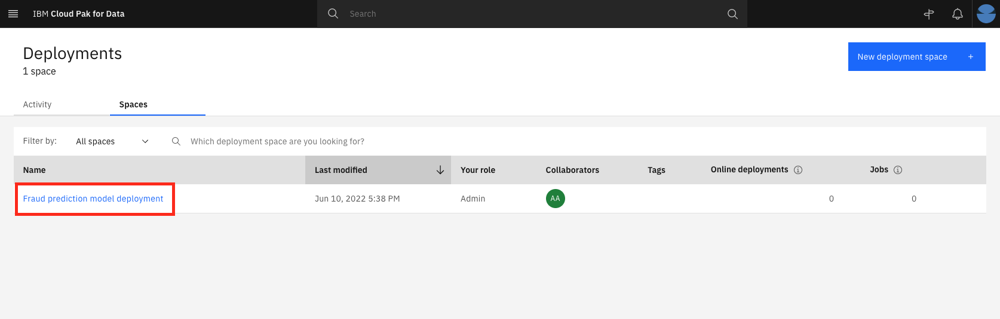

# Build Fraud Prediction model using AutoAI

AutoAI is a capability that automates machine learning tasks to ease the tasks of data scientists. It automatically prepares your data for modeling, chooses the best algorithm for your problem, and creates pipelines for the trained models. AutoAI can be run in public clouds and in private clouds, including IBM Cloud Pak® for Data.

## Learning objectives
This tutorial explains the benefits of the AutoAI service on a use case. This will give you a better understanding of how regression and classification problems can be handled without any code — and how the tasks (feature engineering, model selection, hyperparameter tuning, etc.) are done with this service. This tutorial also includes details for choosing the best model among the pipelines and how to deploy and use these models via IBM Cloud Pak for Data platform. 
* Setup your AutoAI environment and generate pipelines 
* Save AutoAI model 
* Deploy the model 
* Test the model

## Steps
### Step 1. Setup AutoAI environment and generate pipelines

1. To start the AutoAI experience, click Add to Project + and select AutoAI experiment.


2. Name your AutoAI experiment asset and leave the default compute configuration option listed in the drop-down menu. Click **Create**.


3. To configure the experiment, we must give it the dataset to use. Click on the Select from project option.


4. In the dialog, select the name of the shaped dataset that was the output of the data refinery step. Click **Select asset**.


5. On the next window, select **No** for the answer to Create a time series forecast. 


6. Once the dataset is read in, we need to indicate what we want the model to predict. Under the Select prediction column, find and select the FRAUD_REPORTED row.


6. Click on Experiment Settings and explore some of the customizable features of an AutoAI experiment.


7. Click Run experiment.


8. The AutoAI experiment will run and the UI will show progress as it happens.


9. The experiment can take several minutes to run. Upon completion, you will see a message that the pipelines have been created.


### Step 2. Save AutoAI model

The AutoAI process by default selects the top-two performing algorithms for a given dataset. After executing the appropriate data pre-processing steps, it follows this sequence for each of the algorithms to build candidate pipelines: 
* Automated model selection 
* Hyperparameter optimization 
* Automated feature engineering 
* Hyperparameter optimization You can review each pipeline and select to deploy the top-performing pipeline from this experiment. 

1. Scroll down to see the Pipeline leaderboard. The top-performing pipeline is in the first rank. 

2. The next step is to select the model that gives the best result by looking at the metrics. In this case, Pipeline 6 gave the best result with the metric “Accuracy (optimized)”. You can view the detailed results by selecting the corresponding pipeline from the leaderboard.


3. The model evaluation page displays metrics for the experiment, feature transformations performed (if any), which features contribute to the model, and more details about the pipeline.


4. To deploy this model, click **Save as**. On the next window, leave the default values and ensure the assets type selected is **Model**. Then click on **Create** to save it. 


5. A notification indicates that the model is saved to the project. Go back to the project’s main page by closing the Pipeline details window and clicking on the project name on the navigator on the top left.
The new model is listed under the Models section of the Assets page.


### Step 3. Deploy the model 

1. Under the Models section of the Assets page, click the name of the saved model. 

2. To make the model available to be deployed, we first need to make it available in the deployment space. Click on Promote to deployment space. 


3. Create deployment space by selecting the option **Create a deployment space** in the target space dropdown. Enter the name of the deployment space and click **Create**. You will get the notification that the space is ready in a couple of seconds. Click **Close** on the notification window.


4. Now click on **Promote** to promote your model to the deployment space. 


5. You will see a notification that the model was promoted to the deployment space successfully. Click Deployment space from this notification. You can also reach this page by using the hamburger (☰) menu and selecting **Deployments**, then clicking on **Spaces** tab. Select the deployment space. 


5. Under the Assets tab, click on the AutoAI model you just promoted.


6. Click **New deployment** in the top-right corner.


7. On the Create a deployment screen, choose Online for the deployment type, give the deployment a name and an optional description. Click Create.


8. The deployment status will show as “In progress” and change to “Deployed” when finished. 


### Step 4. Test the model 

IBM Cloud Pak for Data offers tools to quickly test out Watson machine learning models. We begin with the built-in tooling. 

1. Click on the deployment. The deployment API reference tab shows how to use the model using cURL, Java, JavaScript, Python, and Scala. Click on the corresponding tabs to get the code snippet in the language you want to use.


2. To get to the built-in test tool, click the Test tab, then click on the Provide input data as JSON icon and paste the following data under Body:
```
{
	"input_data": [
		{
			"fields": [
				"CUSTOMER_ID",
				"CLAIM_ID",
				"POLICY_ID",
				"CAPITAL_GAINS",
				"CAPITAL_LOSS",
				"INCIDENT_DATE",
				"INCIDENT_TYPE",
				"COLLISION_TYPE",
				"INCIDENT_SEVERITY",
				"AUTHORITIES_CONTACTED",
				"INCIDENT_STATE",
				"INCIDENT_CITY",
				"INCIDENT_LOCATION",
				"INCIDENT_HOUR_OF_THE_DAY",
				"NUMBER_OF_VEHICLES_INVOLVED",
				"PROPERTY_DAMAGE",
				"BODILY_INJURIES",
				"WITNESSES",
				"POLICE_REPORT_AVAILABLE",
				"TOTAL_CLAIM_AMOUNT",
				"INJURY_CLAIM",
				"PROPERTY_CLAIM",
				"VEHICLE_CLAIM",
				"POLICY_NUMBER",
				"POLICY_BIND_DATE",
				"POLICY_STATE",
				"POLICY_CSL",
				"POLICY_DEDUCTABLE",
				"POLICY_ANNUAL_PREMIUM",
				"UMBRELLA_LIMIT",
				"COVERAGE",
				"POLICY",
				"RENEW_OFFER",
				"LAST_CLAIM",
				"POLICY_CHANGE",
				"DENIED_CLAIMS",
				"CLAIMS_FILE",
				"AVG_LENGTH_OF_HANDLING_PROCESS",
				"AUTO_MAKE",
				"AUTO_MODEL",
				"AUTO_YEAR",
				"MONTHS_AS_CUSTOMER",
				"AGE",
				"INSURED_SEX",
				"CREDITCARD_CVV",
				"INSURED_EDUCATION_LEVEL",
				"INSURED_HOBBIES",
				"INSURED_RELATIONSHIP",
				"INSURED_OCCUPATION",
				"MARITAL_STATUS",
				"CUSTOMER_LIFETIME_VALUE",
				"NO_OF_POLICIES",
				"NO_OF_CLOSED_COMPLAINTS",
				"NO_OF_COMMUNICATIONS",
				"NO_OF_COMPLAINTS",
				"NO_OF_OPEN_COMPLAINTS",
				"ADDRESS"
			],
			"values": [
				[
					"0032VYL",
					2769854379,
					"D9BGDZLVX",
					0,
					0,
					"2015-01-17",
					"Multi-vehicle Collision",
					"Side Collision",
					"Major Damage",
					"Fire",
					"VA",
					"Arlington",
					"4955 Lincoln Ridge",
					23,
					3,
					"?",
					0,
					3,
					"YES",
					77880,
					12980,
					12980,
					51920,
					872734,
					"1990-05-19",
					"IN",
					"100/300",
					2000,
					1003.23,
					0,
					"Extended",
					"Corporate L1",
					"offer2",
					17,
					0,
					0,
					0,
					23,
					"Accura",
					"MDX",
					2008,
					241,
					38,
					"FEMALE",
					4901,
					"Associate",
					"other",
					"not-in-family",
					"tech-support",
					"Single",
					8247.952072,
					7,
					0,
					4,
					4,
					0,
					"1400 Kempsville Rd. Chesapeake Virginia VA 470485 US"
				]
			]
		}
	]
}
```

3. Click the Predict button and the model will be called with the input data. The results will display in the Result window. You can see the prediction result (“Y” or a “N” for Fraud Claim).


For this example, it has been predicted as fraud claim (Y) with a high probability of around 80%. 

## Summary
This lab tutorial showed you how to setup your AutoAI environment and generate pipeline. You have also learnt how to save the AutoAI model, Deploy and test the model and everything can be done without a single line of code. That’s awesome!
