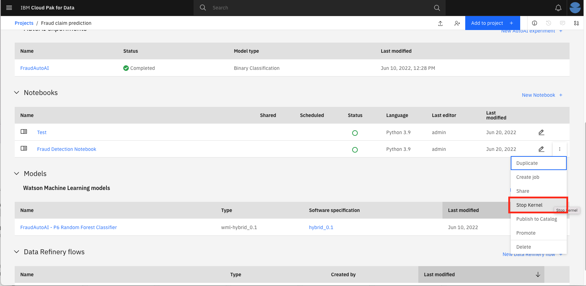
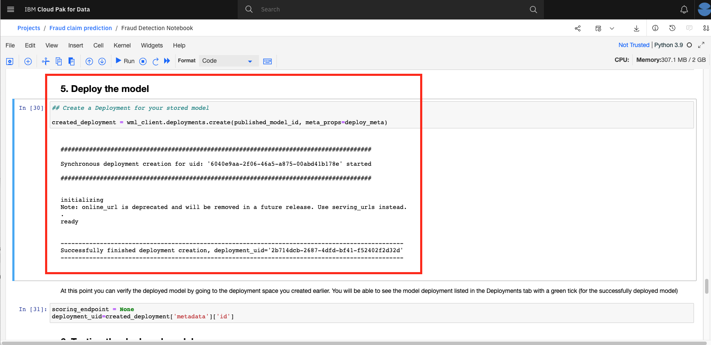

# Build Fraud Prediction model using Watson Studio on Cloud Pak for Data and deploy it on Watson Machine Learning


## Learning objectives
When the reader has completed this Code Pattern, they will understand how to:
* Use [Jupyter Notebooks](https://jupyter.org/) to load, visualize, and analyze data
* Run Notebooks in [IBM Cloud Pak for Data](https://www.ibm.com/analytics/cloud-pak-for-data)
* Build, test, and deploy a machine learning model using [Scikit-learn](https://scikit-learn.org/stable/) on IBM Cloud Pak for Data.
* Deploy a selected machine learning model to production using Cloud Pak for Data
* Test the deployed model using the exposed endpoint

## Flow
1. User loads the Jupyter notebook into the Cloud Pak for Data platform.
2. Fraud claims dataset is loaded into the Jupyter Notebook as virtualized data after following the Data virtualization and Data refinery tutorial.
3. Preprocess the data, build machine learning models and save to Watson Machine Learning on Cloud Pak for Data.
4. Deploy a selected machine learning model into production on the Cloud Pak for Data platform and obtain a scoring endpoint.
5. Test the deployed model using the scoring endpoint.


## Steps
1. [Import notebook to Cloud Pak for Data](#1-import-notebook-to-cloud-pak-for-data)
1. [Run the notebook](#2-run-the-notebook)
1. [Create a Space for Machine Learning Deployments](#3-create-a-space-for-machine-learning-deployments)
1. [Deploying the model](#4-deploying-the-model-using-the-Cloud-Pak-for-Data-UI)
1. [Testing the model](#5-testing-the-model)


### 1. Import notebook to Cloud Pak for Data
* In your project, click the `Add to project +` button, and choose `Notebook`


* On the next screen, select the *From URL* tab, give your notebook a *name* and an optional *description*, provide the following URL as the *Notebook URL*, and ensure that `Python 3.9` environment is selected by default as the *Runtime*:

```bash
https://raw.githubusercontent.com/ibm-hcbt/cp4d-assets/main/Fraud_claim_use_case/fraud_detection_model.ipynb
```


* When the Jupyter notebook is loaded and the kernel is ready then we can start executing cells.


> **Important**: *Make sure that you stop the kernel of your notebook(s) when you are done, in order to conserve memory resources!*




### 2. Run the notebook

Spend some time looking through the sections of the notebook to get an overview. A notebook is composed of text (markdown or heading) cells and code cells. The markdown cells provide comments on what the code is designed to do.

You will run cells individually by highlighting each cell, then either click the `Run` button at the top of the notebook or hitting the keyboard short cut to run the cell (Shift + Enter but can vary based on platform). While the cell is running, an asterisk (`[*]`) will show up to the left of the cell. When that cell has finished executing a sequential number will show up (e.g. `[17]`).

**Please note that some of the comments in the notebook are directions for you to modify specific sections of the code. Perform any changes as indicated before running / executing the cell.**

#### Notebook sections

With the notebook open, you will notice:

- Section `2.0 Add Dataset` will load the data set we will use to build out the machine learning model. In order to import the data into the notebook, we are going to use the code generation capability of Watson Studio.
   - Highlight the code cell shown in the image below by clicking it. Ensure you place the cursor below the commented line.
   - Click the 01/00 "Find data" icon in the upper right of the notebook to find the data asset you need to import.
   - Choose the *Files* tab, and pick the virtualized and refined data set that has all three joined tables (i.e. `User<xyz>_POLICIESCLAIMSCUSTOMERS_shaped`). Click `Insert to code` and choose `pandas DataFrame`.


   - The code to bring the data into the notebook environment and create a Pandas DataFrame will be added to the cell.
   - Run the cell and you will see the first five rows of the dataset.


- Section `3.0 Create a model` cells will run through the steps to build a model pipeline.
   - We will split our data into training and test data, encode the categorial string values, create a model using the Logistic Regression, Random Forest Classifier algorithm, and evaluate the model against the test set.
   - Run all the cells in section 3 to build the model.


### 3. Save the model

NOTE: If you have not completed the AutoAI tutorial in this learning path, you might not have created the deployment space. Follow step 3.3 in this tutorial: https://github.com/ibm-hcbt/cp4d-assets/blob/511667b796031bff325c3cb8672973407b2026ef/Fraud_claim_use_case/3A.%20Build%20model%20using%20AutoAI.md to create a deployment space.

- Section `4.0 Save the model` will save the model to your project.

- We will be saving and deploying the model to the Watson Machine Learning service within our Cloud Pak for Data platform.

- In Section 4.3, update the `MODEL_NAME` variable and provide a unique and easily identifiable model name. Next, update the `DEPLOYMENT_SPACE_NAME` variable, providing the name of your deployment space which was created in step 3.3 of the [AutoAI tutorial](https://github.com/ibm-hcbt/cp4d-assets/blob/511667b796031bff325c3cb8672973407b2026ef/Fraud_claim_use_case/3A.%20Build%20model%20using%20AutoAI.md)


Continue to run the cells in the section to save the model to Cloud Pak for Data. We'll be able to test it out with the Cloud Pak for Data tools in just a few minutes!


### 4. Deploying the model

Now that we have created a model and saved it to our respository, we will want to deploy the model so it can be used by others. 

We will be creating an online deployment. This type of deployment will make an instance of the model available to make predictions in real time via an API. 

Continue to run the cells in the section 5 deploy the model to the associated Watson Machine Learning. We'll be able to test it out with the Cloud Pak for Data tools in just a few minutes!


### 5. Testing the model

Cloud Pak for Data offers tools to quickly test out Watson Machine Learning models. We begin with the built-in tooling.

- Click on the deployment. The Deployment *API reference* tab shows how to use the model using *cURL*, *Java*, *Javascript*, *Python*, and *Scala*. Click on the corresponding tab to get the code snippet in the language that you want to use:


#### Test the saved model with built-in tooling

- To get to the built-in test tool, click on the Test tab. Click on the `Provide input data as JSON` icon and paste the following data under Body:

```json
{
	"input_data": [{
		"fields": ["capital_gains", "capital_loss", "incident_hour_of_the_day", "number_of_vehicles_involved", "witnesses", "total_claim_amount", "policy_annual_premium", "insured_sex_FEMALE", "insured_sex_MALE", "insured_occupation_adm-clerical", "insured_occupation_armed-forces", "insured_occupation_craft-repair", "insured_occupation_exec-managerial", "insured_occupation_farming-fishing", "insured_occupation_handlers-cleaners", "insured_occupation_machine-op-inspct", "insured_occupation_other-service", "insured_occupation_priv-house-serv", "insured_occupation_prof-specialty", "insured_occupation_protective-serv", "insured_occupation_sales", "insured_occupation_tech-support", "insured_occupation_transport-moving", "insured_hobbies_chess", "insured_hobbies_cross-fit", "insured_hobbies_other", "incident_type_Multi-vehicle Collision", "incident_type_Parked Car", "incident_type_Single Vehicle Collision", "incident_type_Vehicle Theft", "collision_type_Front Collision", "collision_type_Rear Collision", "collision_type_Side Collision", "collision_type_Unknown", "incident_severity_Major Damage", "incident_severity_Minor Damage", "incident_severity_Total Loss", "incident_severity_Trivial Damage", "authorities_contacted_Ambulance", "authorities_contacted_Fire", "authorities_contacted_None", "authorities_contacted_Other", "authorities_contacted_Police"],
		"values": [
			[0, 0, 16, 1, 2, 100210, 1241.04, 1, 0, 0, 0, 0, 0, 0, 0, 0, 0, 0, 0, 1, 0, 0, 0, 0, 0, 1, 0, 0, 1, 0, 1, 0, 0, 0, 0, 1, 0, 0, 0, 0, 0, 0, 1],
			[0, 0, 6, 3, 2, 53730, 1437.53, 1, 0, 0, 0, 0, 0, 0, 0, 0, 0, 0, 0, 0, 0, 0, 1, 1, 0, 0, 1, 0, 0, 0, 0, 0, 1, 0, 0, 1, 0, 0, 1, 0, 0, 0, 0],
			[91900, 0, 22, 4, 0, 71760, 1083.01, 0, 1, 0, 0, 1, 0, 0, 0, 0, 0, 0, 0, 0, 0, 0, 0, 0, 0, 1, 1, 0, 0, 0, 1, 0, 0, 0, 1, 0, 0, 0, 0, 0, 0, 0, 1],
			[0, 0, 10, 1, 1, 70700, 1405.71, 1, 0, 0, 0, 1, 0, 0, 0, 0, 0, 0, 0, 0, 0, 0, 0, 0, 0, 1, 0, 0, 1, 0, 0, 1, 0, 0, 0, 0, 1, 0, 0, 0, 0, 0, 1],
			[0, 0, 16, 2, 2, 44110, 1403.9, 1, 0, 0, 0, 0, 0, 1, 0, 0, 0, 0, 0, 0, 0, 0, 0, 0, 0, 1, 1, 0, 0, 0, 0, 0, 1, 0, 0, 0, 1, 0, 0, 0, 0, 0, 1]
		]
	}]
}
```

- Click the `Predict` button  and the model will be called with the input data. The results will display in the *Result* window. Scroll down to the bottom (Line #114) to see either a "Yes" or a "No" for Churn:


