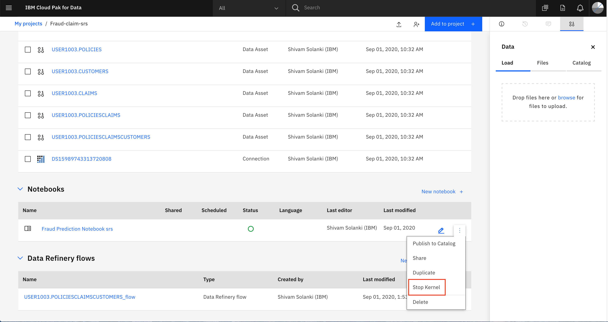
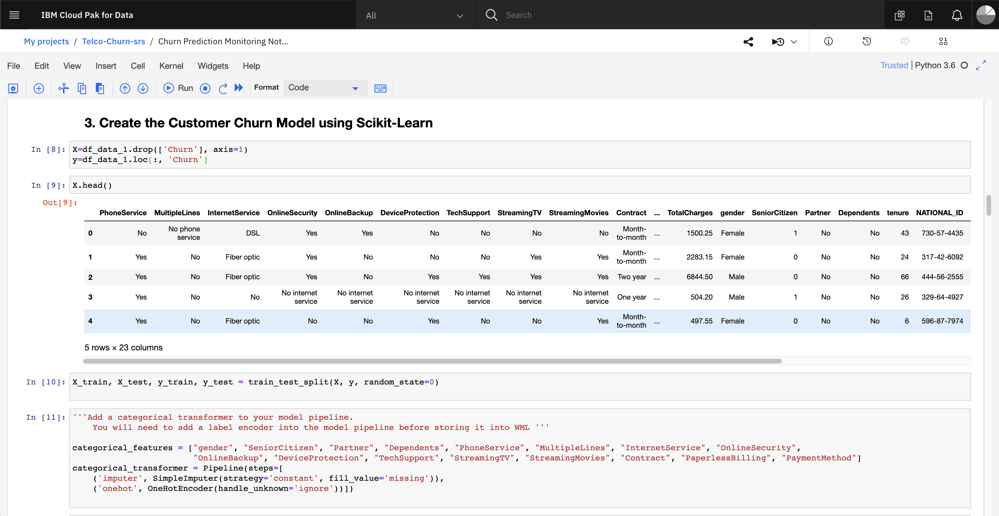
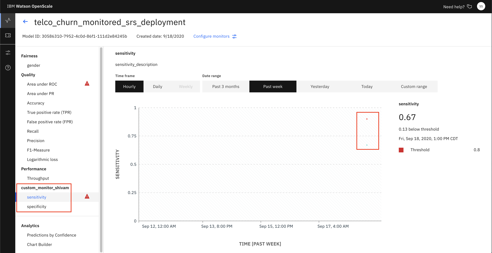

# Monitor IBM Cloud Pak With Watson OpenScale

In this Code Pattern, we will use Telco churn data to train, create, and deploy a machine learning model using [Watson Machine Learning](https://www.ibm.com/cloud/machine-learning/) on [Cloud Pak for Data (CP4D)](https://www.ibm.com/analytics/cloud-pak-for-data). We will create a data mart for this model with [Watson OpenScale](https://www.ibm.com/cloud/watson-openscale/) and configure OpenScale to monitor that deployment, then inject sample test data for viewing in the OpenScale Insights dashboard.

When the reader has completed this Code Pattern, they will understand how to:

* Create and deploy a machine learning model using the Watson Machine Learning service on IBM Cloud Pak for Data (ICP4D).
* Setup Watson OpenScale Data Mart
* Bind Watson Machine Learning to the Watson OpenScale Data Mart
* Add subscriptions to the Data Mart
* Enable payload logging and performance monitor for subscribed assets
* Enable Quality (Accuracy) monitor
* Enable Fairness monitor
* Score the Customer churn prediction model using the Watson Machine Learning


## Flow

1. The developer creates a Jupyter Notebook within this project.
1. OpenScale on ICP4D is connected to a DB2 database, which is used to store Watson OpenScale data.
1. The notebook is connected to Watson Machine Learning and a model is trained and deployed.
1. Watson OpenScale is used by the notebook to log payload and monitor performance, quality, and fairness.
1. OpenScale will monitor the Watson Machine Learning model for performance, fairness, quality, and explainiblity.


# Steps

1. [Import Jupyter Notebook to IBM Cloud Pak for Data](#1-import-jupyter-notebook)
1. [Run the notebook](#2-run-the-notebook)
1. [Configure OpenScale in a Jupyter Notebook](#3-configure-openscale-in-a-jupyter-notebook)
1. [Utilize the dashboard for OpenScale](#4-utilize-the-dashboard-for-openscale)

## 1. Import notebook to Cloud Pak for Data

* In your project, either click the `Add to project +` button, and choose `Notebook`


* On the next screen, select the *From URL* tab, give your notebook a *name* and an optional *description*, provide the following URL as the *Notebook URL*, and choose the `Python 3.6` environment as the *Runtime*:

```bash
https://raw.githubusercontent.com/Shivam6693/CP4D_workshop/master/Telco_churn_use_case/Watson_OpenScale/churn_model_monitoring.ipynb
```


* When the Jupyter notebook is loaded and the kernel is ready then we can start executing cells.


> **Important**: *Make sure that you stop the kernel of your notebook(s) when you are done, in order to conserve memory resources!*



## 2. Run the notebook

Spend some time looking through the sections of the notebook to get an overview. A notebook is composed of text (markdown or heading) cells and code cells. The markdown cells provide comments on what the code is designed to do.

You will run cells individually by highlighting each cell, then either click the `Run` button at the top of the notebook or hitting the keyboard short cut to run the cell (Shift + Enter but can vary based on platform). While the cell is running, an asterisk (`[*]`) will show up to the left of the cell. When that cell has finished executing a sequential number will show up (e.g. `[17]`).

**Please note that some of the comments in the notebook are directions for you to modify specific sections of the code. Perform any changes as indicated before running / executing the cell.**

#### Notebook sections

With the notebook open, you will notice:

- Section `1.2 Install required packages` will install some of the libraries we are going to use in the notebook (many libraries come pre-installed on Cloud Pak for Data). Note that we upgrade the installed version of Watson Machine Learning Python Client. Ensure the output of the first code cell is that the python packages were successfully installed.


- Section `2.0 Add Dataset` will load the data set we will use to build out the machine learning model. In order to import the data into the notebook, we are going to use the code generation capability of Watson Studio.
   - Highlight the code cell shown in the image below by clicking it. Ensure you place the cursor below the commented line.
   - Click the 01/00 "Find data" icon in the upper right of the notebook to find the data asset you need to import.
   - Choose the *Files* tab, and pick the virtualized data set that has all three joined tables (i.e. `User<xyz>.POLICIESCLAIMSCUSTOMERS_shaped.csv`). Click `Insert to code` and choose `pandas DataFrame`.


   - The code to bring the data into the notebook environment and create a Pandas DataFrame will be added to the cell.
   - Run the cell and you will see the first five rows of the dataset.


   - Continue to run the remaining cells in section 2 to explore and clean the data.

- Update credentials

* In the notebook section 2.3 you will add your ICP platform credentials.
* For the `username`, use your login username.
* For the `password`, user your login password.

- Section `3.0 Create a model` cells will run through the steps to build a model pipeline.
   - We will split our data into training and test data, encode the categorial string values, create a model using the Logistic Regression, Random Forest Classifier algorithm, and evaluate the model against the test set.
   - Run all the cells in section 3 to build the model.

- Section `4.0 Create a new deployment` cells will run through the steps to deployed the model pipeline.
   - We will store, score and deploy the linear SVC model using Watson Machine Learning
   - Run all the cells in section 4 to deploy the model.




## 3. Configure OpenScale in a Jupyter Notebook

For this part of the pattern we're going to configure our Watson OpenScale service by running the Jupyter Notebook.
Follow the instructions mentioned in the notebook

- Section `4.0 Setup your Watson OpenScale Dashboard` cells will run through the steps to setup the monitoring dashboard.
   - We will create a Watson OpenScale client and then use it to setup the Datamart and add machine learning provider
   - Then we will perform initial scoring for our Model deployment to create a new subscription
   - We will also perform initial payload logging to finally setup Quality Monitoring
   - Run all the cells in section 5 to configure the dashboard.


### Get transactions for Explainability

Under `8 Identify transactions for Explainability` run the cell. It will produce a series of UIDs for indidvidual ML scoring transactions. Copy one or more of them to examine in the next section.

## 4. Utilize the dashboard for Openscale

Now that you have created a machine learning model and configured Openscale, you can utilize the OpenScale dashboard to gather insights.

### Use the insights dashboard

The *Insights Dashboard* provides an overview of the models that OpenScale is monitoring.

* Open the `Services` tab by clicking the icon in the upper right. Go to the `OpenScale` tile under the `AI` category and click `Open`:


OpenScale will begin with the *Insights Dashboard*. This can contain tiles for many configured monitors. 

* Click on the left-hand menu icon for `Insights`, and then choose the tile for the dashboard you have created :


You will see the dashboard. The green indicates if it has passed the test and red indicated alerts. Alerts are configurable, based on thresholds for fairness outcomes which can be set and altered as desired.

Click on the Quality to view the details.


* By moving your mouse pointer over the graph, you can see the point. Click on spot to veiw the details.


* Once you open the details page, you can see more information on the performance of the model.


* Go back and check out the custom monitors that we created in the notebook


